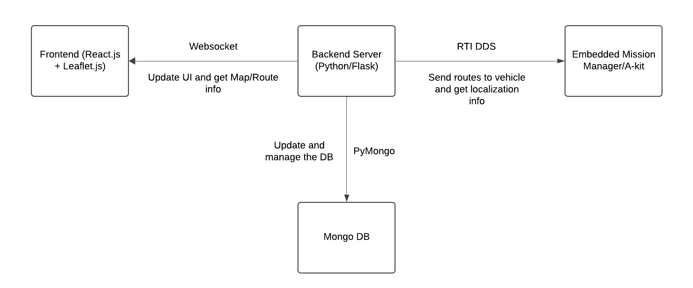
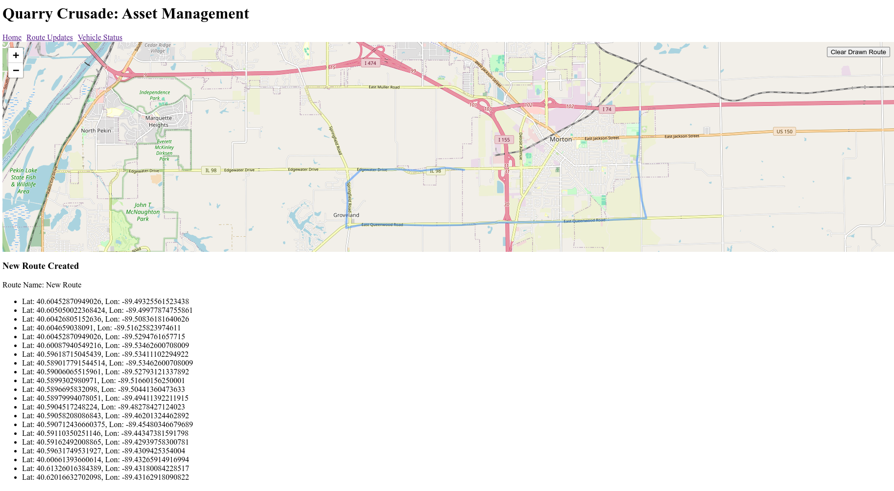

# Quarry Crusade
Let's throw some F bombs on MM/OPP

## Initial Architecture

The initial architecture idea:

## Overview of Components and Responsibilities:

### Frontend:
**React**: Handles UI logic, including state management and rendering UI components like the map, vehicle status, route info, etc.

**Leaflet**: Handles map rendering and interactions (e.g., drawing routes, display vehicle pose).

### Backend:
**Flask (Server)**: Manages the backend logic, handle DDS communication, updating the database, and managing WebSocket connections and the overall state of all assets.

**MongoDB**: Stores data (maps, routes, assignments, and zones etc.). Details of the info needed will follow soon.

### Communication Protocols:
**RTI Connext DDS**: Communication between the server and autonomous trucks, sending route assignments and receiving vehicle status updates.

**WebSockets**: Used for bidirectional communication between the Flask server and the React frontend to push updates and receive user interactions.

## Pictures of the current state

